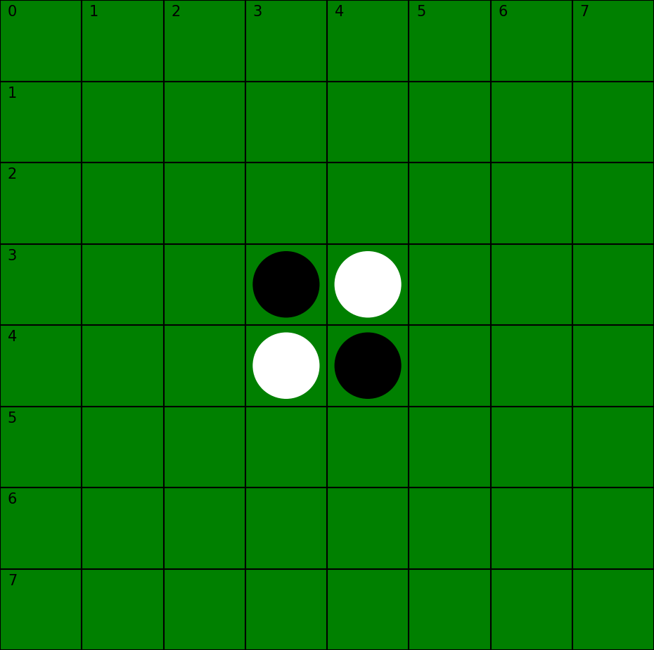

# AlphaZero applied to Othello

**Authors:** Tom LABIAUSSE - Amine CHERIF HAOUAT - Sami JALLOULI

**Date:** Feb/Mar 2024

## 0 - Setup

* Clone the repository:
```bash
git clone git@github.com:t0m1ab/alphazero.git
```

* Install `alphazero` as a package in edit mode (see config in `pyproject.toml`): 
```bash
mv alphazero/
pip install -e .
``` 

* You should be able to run tests on the package or print the docs with the following commands in the terminal: 
```bash
alphazero --test
alphazero --help
``` 

## 1 - Files

* `base`: implement parent classes such as *Board* (and TODO *PolicyNet*)
* `players.py`: implement different game strategies
* `mcts.py`: implement Monte Carlo Tree Search
* `trainers.py`: TODO
* `arena.py`: organize several games between players and compare results
* `game_ui.py`: interface between user and algorithm to play a game (TODO using gradio)
* `contests.py`: define specific contests between players
* `utils.py`: utility functions
* `tests.py`: contains various test that can be run to check the implementation

### games/
* `othello.py`: implementation of Othello env
* `connect4.py`: TODO
* `tictactoe.py`: TODO

### docs/
* `help.txt`: general informations

### figures/
* `othello_board_8x8_init.png`: example of Othello 8x8 board display



## 2 - Demo

### 2.1 - Play against MCTSPlayer

```bash
python game_ui.py
```

Change code in `game_ui.py` to modify the machine player and/or the game settings. The state of the board will be automatically saved as a PNG file in `outputs/` and overwrite itself after each move.

### 2.2 - Compare machine players

```bash
python contests.py
```

Change code in `contests.py` to modify the machine players and/or the game settings.
