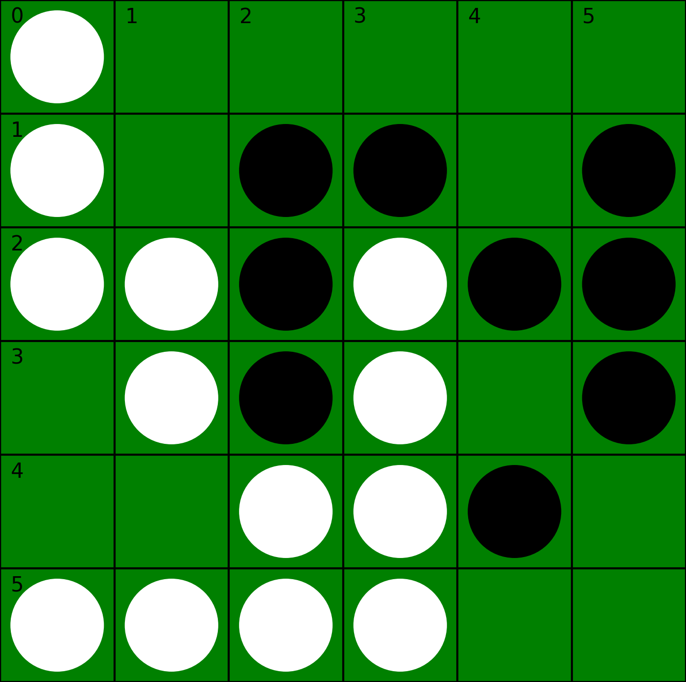
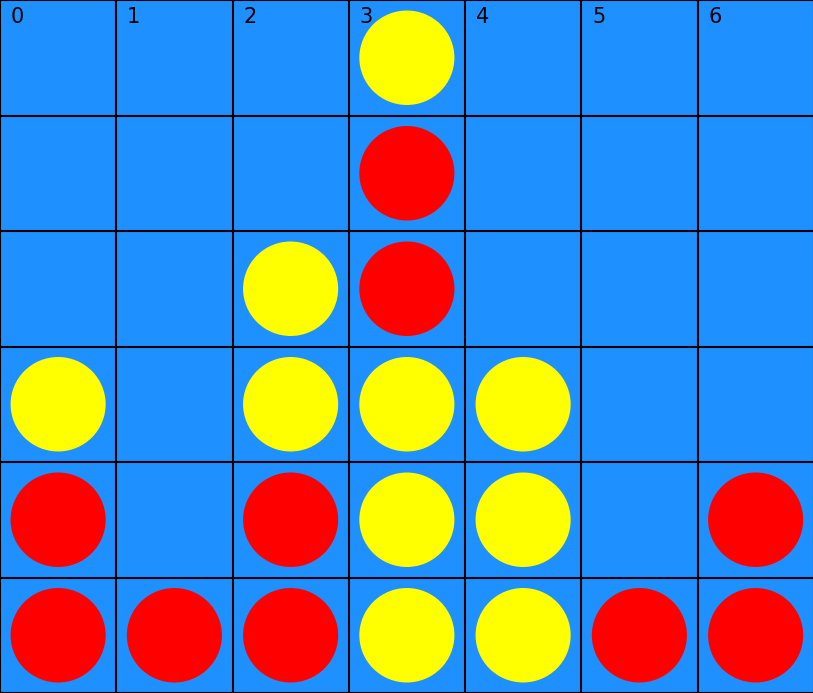
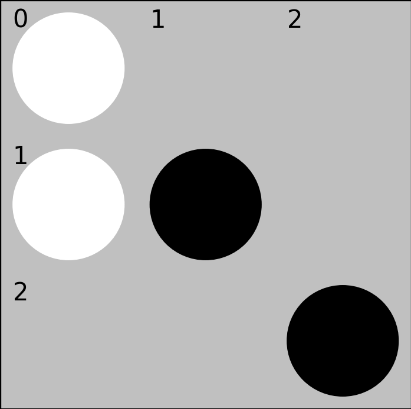

# AlphaZero applied to board games

**Authors:** Tom LABIAUSSE - Amine CHERIF HAOUAT - Sami JALLOULI

**Date:** Feb/Mar 2024

## 0 - Setup

* Clone the repository:
```bash
git clone git@github.com:t0m1ab/alphazero.git
```

* Install `alphazero` as a package in edit mode (see config in `pyproject.toml`): 
```bash
cd alphazero/
pip install -e .
``` 

* You should be able to run tests on the package or print the docs with the following commands in the terminal: 
```bash
alphazero --test
alphazero --help
```

* Download the alphazero networks available in our [Huggingface Hub](https://huggingface.co/t0m1ab) using one of the following equivalent commands: 
```bash
alphazero --download
```
```python
python alphazero/download.py
``` 
All models and configuration files will be stored in a `models/` folder by default when loading or training a player.

## 1 - Files

### alphazero/
* `base`: implement parent classes such as *Board*, *Player*, *PolicyValueNetwork*...
* `players.py`: implement different game strategies (random, greedy, mcts, alphazero, human)
* `mcts.py`: implement Monte Carlo Tree Search (rollout or neural evaluation mode)
* `schedulers.py`: implement temperature schedulers for MCTS during AlphaZero training
* `trainers.py`: implement a trainer for AlphaZero
* `timers.py`: define timers to perform alphazero training time estimation
* `arena.py`: organize games between players and display results (sequential or parallel mode)
* `game_ui.py`: interface between user and algorithm to play a game
* `contests.py`: define specific contests between players
* `visualization.py`: define plot functions to create training/evaluation graphs
* `utils.py`: utility functions
* `tests.py`: contains various tests that can be run to check the implementation
* `download.py`: run to download alphazero networks stored on a HuggingFace Hub
* `run.sh`: run to launch a training

### alphazero/games/
* `registers.py`: define configurations, boards and networks mapping for each game using their name
* `othello.py`: implementation of the Othello environment, game config and neural network for AlphaZero
* `tictactoe.py`: implementation of the Connect4 environment, game config and neural network for AlphaZero
* `connect4.py`: implementation of the Tictactoe environment, game config and neural network for AlphaZero

### docs/
* `help.txt`: general informations

### figures/
* `othello_board_example.png`: example of Othello 8x8 board with human display
* `connect4_board_example.png`: example of Connect4 board with human display
* `tictactoe_board_example.png`: example of Tictactoe board with human display





## 2 - Demo

Go in the code folder `alphazero/` to execute any of the following commands.

### 2.1 - Play against the machine with the CLI

Use `game_cli.py` to launch a game against the machine. The state of the board will be automatically saved as a PNG file in `outputs/` and overwrite itself after each move. Examples of commands can be found below or at the end of `game_cli.py`. 

```bash
python game_ui.py --othello --mcts
python game_ui.py --connect4 --net alphazero-connect4 --infos
python game_ui.py --tictactoe --net alphazero-tictactoe --display pixel --bot-starts
```

### 2.2 - Compare machine players

```bash
python contests.py
```

Change the contest function called in `contests.py` to modify the machine players and/or the game settings.

### 2.3 - Train an AlphaZero player

```bash
bash run.sh
```

Use the options of `trainer.py` in `run.sh` to change the name of the experiment, the game or the configuration.

Freeze the default configurations as JSON files with the following command:
```bash
python trainers.py -f
```
